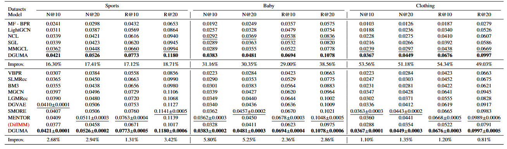

## DGUMA
Diffusion-Driven Graph and User Modal Augmentation for Long-Tail Multimodal Recommendations

## 📝 Environment
We develop our codes in the following environment:

- python==3.9.13
- numpy==1.23.1
- torch==1.11.0
- scipy==1.9.1
  
## 🚀 How to run the codes
```python
cd ./src
python main.py
```

## 👉 DataSet
We provide three processed datasets: Baby, Sports, Clothing.

Download from Baidu Netdisk:[Sports/Baby/Clothing][2]                  提取码: cz6u .


## 🎯 Experimental Results

Performance comparison of baselines on different datasets in terms of Recall@20 and NDCG@20:



## Acknowledgement
We are particularly grateful to the authors of [MMReC][1], as parts of our code implementation were derived from this work.

[1]: https://github.com/enoche/MMRec
[2]:https://pan.baidu.com/s/1c7KFHVmC3Z2370DEJbztlg
